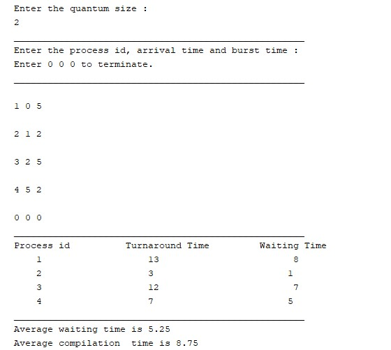
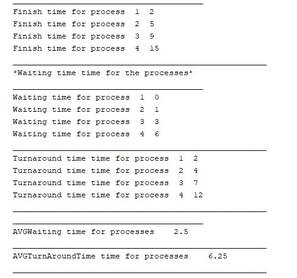

# RoundRobin-and-Shortest-Jop-First
This project contains Java implementations of two CPU scheduling algorithms: RoundRobin (RR) and Shortest-Jop-First (SJF).

## RoundRobin
round-robin scheduler generally employs time-sharing, giving each job a time slot or quantum[5] (its allowance of CPU time), and interrupting the job if it is not completed by then. The job is resumed next time a time slot is assigned to that process. If the process terminates or changes its state to waiting during its attributed time quantum, the scheduler selects the first process in the ready queue to execute. In the absence of time-sharing, or if the quanta were large relative to the sizes of the jobs, a process that produced large jobs would be favored over other processes.
Round-robin algorithm is a pre-emptive algorithm as the scheduler forces the process out of the CPU once the time quota expires.
Here it the implementation <a href = "https://github.com/OmarTamer242/RoundRobin-and-Shortest-Jop-First/blob/main/RoundRobin/src/RoundRobin/RoundRobin.java">RoundRobin.java</a>

## Shortest-Jop-First
Shortest Job First (SJF) is an algorithm in which the process having the smallest execution time is chosen for the next execution. This scheduling method can be preemptive or non-preemptive. It significantly reduces the average waiting time for other processes awaiting execution. The full form of SJF is Shortest Job First.
Here is the implementation <a href = "https://github.com/OmarTamer242/RoundRobin-and-Shortest-Jop-First/blob/main/SJF/src/SJF/SJF_m.java">SJF_m.java</a>

